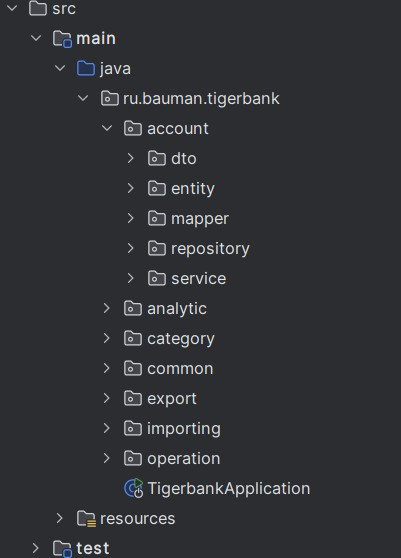
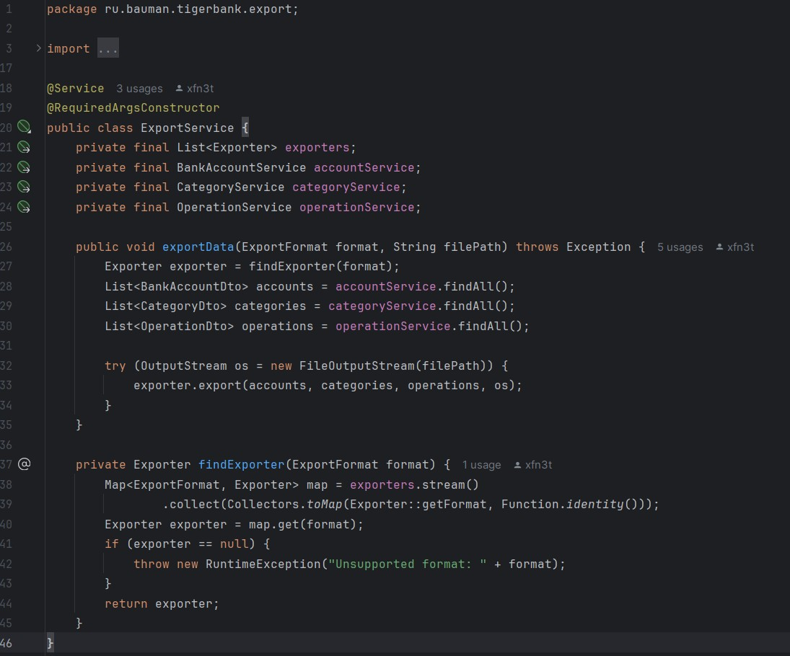
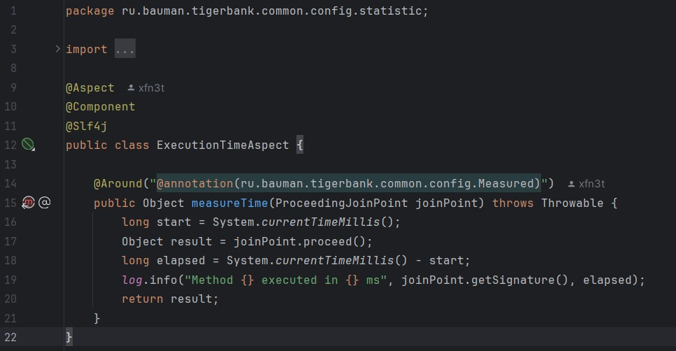
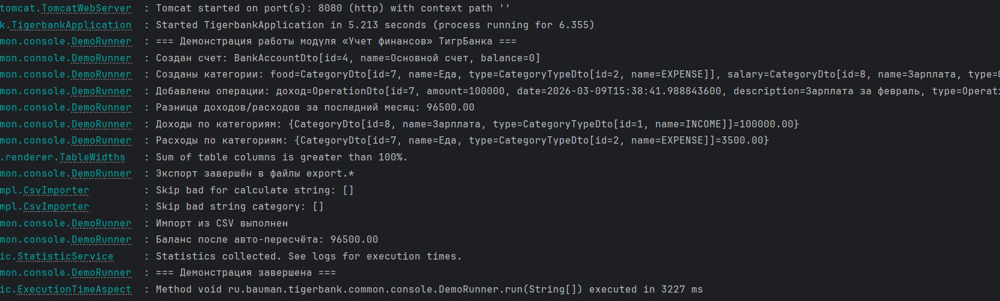
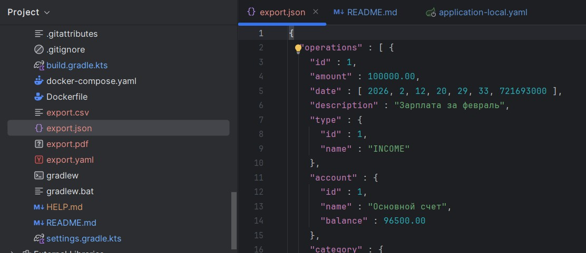
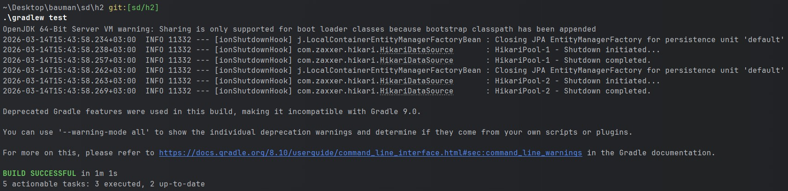

# Модуль «Учет финансов» ТигрБанка

## Предметная область

Программа моделирует базовый функционал личного финансового учета. Пользователь может создавать банковские счета, категории доходов и расходов, а также операции (доходы/расходы), привязанные к конкретному счету и категории. На основе операций автоматически рассчитывается баланс счета. Система позволяет анализировать доходы и расходы за период, группировать их по категориям, выполнять импорт и экспорт данных, а также пересчитывать баланс при необходимости.

Основные сущности:

- **BankAccount** — счет: идентификатор, название, баланс.
- **Category** — категория: идентификатор, название, тип (доход/расход).
- **Operation** — операция: идентификатор, тип (доход/расход), ссылка на счет, сумма, дата, описание, ссылка на категорию.

---

## Соответствие принципам SOLID

### 1. Single Responsibility Principle

Каждый класс отвечает за одну четко определенную зону ответственности:
- `BankAccount` хранит только данные счета.
- `BankAccountServiceImpl` содержит бизнес-логику (создание, обновление, удаление, поиск).
- `BankAccountEntityServiceImpl` инкапсулирует операции с БД через репозиторий.
- `BankAccountMapper` (MapStruct) отвечает исключительно за преобразование между сущностью и DTO.

### 2. Open/Closed Principle

Система открыта для расширения и закрыта для изменения:
- Добавление нового формата экспорта/импорта (например, XML) требует только создания класса, реализующего `Exporter`/`Importer`. `ExportService` и `ImportService` не нуждаются в изменениях.
- `BalanceCalculator` — интерфейс; замена алгоритма расчета баланса не затрагивает `BalanceRecalculationServiceImpl`.

### 3. Liskov Substitution Principle

Все реализации интерфейсов взаимозаменяемы без изменения клиентского кода:
- `CsvExporter`, `JsonExporter`, `YamlExporter`, `PdfExporter` используются через интерфейс `Exporter` в `ExportService`.
- `DefaultBalanceCalculator` полностью заменяем любой другой реализацией `BalanceCalculator`.

### 4. Interface Segregation Principle

Интерфейсы узкоспециализированы и не содержат лишних методов:
- `BalanceCalculator` — только `calculate()`.
- `BalanceRecalculationService` — только `autoRecalc()` и `manualRecalc()`.
- `BankAccountEntityService` отделен от `BankAccountService`: первый — операции с БД, второй — бизнес-логика.

### 5. Dependency Inversion Principle

Все модули верхнего уровня зависят от абстракций:
- `DemoRunner`, `ExportService`, `AnalyticsServiceImpl` зависят от интерфейсов, а не от конкретных классов.
- Внедрение зависимостей выполняется через конструктор (`@RequiredArgsConstructor`).

---

## Использование DI-контейнера

В проекте используется Spring Framework в роли DI-контейнера. Все бины (сервисы, репозитории, мапперы, экспортеры, импортеры) управляются контейнером и объявляются через `@Service`, `@Component`, `@Repository`. Внедрение выполняется через конструктор.

Ключевой пример: `ExportService` получает `List<Exporter>` — Spring автоматически собирает все реализации интерфейса из контекста. Добавление нового экспортера происходит без какой-либо модификации `ExportService`.

---

## Модульное тестирование

Покрыты два уровня тестирования.

### Юнит-тесты (Mockito)

| Класс теста | Что проверяется |
|---|---|
| `BankAccountServiceImplTest` | CRUD-методы сервиса: корректное делегирование к EntityService и маперу, обнуление id при создании |
| `BalanceRecalculationServiceImplTest` | `autoRecalc` устанавливает рассчитанный баланс; `manualRecalc` корректирует если значения расходятся, и не делает лишний save если совпадают |
| `AnalyticsServiceImplTest` | Расчет разницы доходов/расходов; группировка операций по категориям с правильными суммами |

### Интеграционные тесты (Testcontainers + PostgreSQL 15)

| Класс теста | Что проверяется |
|---|---|
| `BankAccountEntityServiceIntegrationTest` | Сохранение и получение по id, удаление, получение всех записей — реальная БД |
| `ExportImportIntegrationTest` | Полный цикл: создание данных → экспорт в CSV → удаление данных → импорт из CSV → проверка восстановления |

Тесты запускаются с профилем `test`, что исключает выполнение `DemoRunner` при прогоне тестового контекста.

---

## Демонстрация работы

### Структура проекта

Проект разбит на пакеты по доменным областям: `account`, `category`, `operation`, `analytic`, `export`, `importing`, `common`. Внутри каждого пакета выдержана единая структура: `entity`, `dto`, `repository`, `mapper`, `service` (интерфейс и `impl`-реализация).

### Принцип Open/Closed на примере ExportService

`ExportService` получает `List<Exporter>` через конструктор. Spring автоматически собирает все реализации из контекста. Добавление нового формата — только новый `@Component`, существующий код не меняется.

### AOP-измерение времени

Аспект `ExecutionTimeAspect` перехватывает методы, помеченные `@Measured`, и логирует время выполнения. Бизнес-логика не затронута.

### Запуск приложения и вывод в консоль

При старте `DemoRunner` последовательно демонстрирует: создание счета и категорий, добавление операций, аналитику, экспорт в четыре формата, импорт из CSV, пересчет баланса.

### Сгенерированные файлы экспорта

После запуска в корне проекта появляются четыре файла экспорта.

### Результаты тестов

Все тесты проходят, включая интеграционные на реальном PostgreSQL через Testcontainers.

---

## Проблемы при добавлении нового функционала

**1. Расширение интерфейса `Exporter`/`Importer`**
Если потребуется добавить контекст (например, фильтрацию по периоду), придется менять сигнатуру метода `export()` во всех существующих реализациях. Решение: ввести объект-параметр `ExportContext`.

**2. Новый тип операции сломает `OperationTypeEnum`**
Перевод между счетами требует двустороннего изменения баланса. Сейчас `OperationTypeEnum` жестко задает функцию эффекта (`applyEffect`). Для расширяемости правило расчета лучше хранить в БД как атрибут `OperationType`.

**3. Статистика не агрегируется**
`StatisticService.printStatistics()` содержит заглушку. Аспект логирует время, но не передает данные в сервис. При добавлении полноценной аналитики потребуется связать аспект с хранилищем статистики.

---

## Аргументы в пользу введенных абстракций

- **`Exporter`/`Importer`** — добавление PDF-экспорта не потребовало изменений ни в одном существующем классе.
- **Разделение `*EntityService` и бизнес-сервисов** — `BankAccountEntityService` можно заменить (например, на кэшированную версию) без изменения `BankAccountServiceImpl`. В тестах это позволяет замокать EntityService и тестировать бизнес-логику изолированно.
- **`BalanceCalculator`** — стратегия расчета вынесена отдельно, что позволяет в `BalanceRecalculationServiceImplTest` передавать мок-калькулятор и проверять только логику пересчета.
- **`AnalyticsService`** — реализацию можно заменить на более производительную без изменения `DemoRunner`.

---

## Работа с данными из файлов

Реализован экспорт в форматы **CSV, JSON, YAML, PDF** и импорт из **CSV, JSON, YAML**.

- **Экспорт** — все счета, категории и операции сохраняются в файл выбранного формата через соответствующий `Exporter`.
- **Импорт** — данные читаются из файла; если запись с таким id уже существует, она обновляется; иначе создается новая. Поддерживается маппинг старых id на новые для корректной привязки операций к счетам и категориям.
- Корректность цикла экспорт → удаление → импорт проверяется интеграционным тестом `ExportImportIntegrationTest`.

---

## Статистика и пересчет баланса

- Измерение времени реализовано через AOP-аспект `ExecutionTimeAspect` и аннотацию `@Measured`. Время выполнения `DemoRunner.run()` логируется без изменения бизнес-логики.
- Автоматический пересчет баланса (`autoRecalc`) суммирует все операции счета через `BalanceCalculator` и сохраняет результат. Ручной пересчет (`manualRecalc`) дополнительно перезаписывает баланс указанным значением, если автоматическое не совпадает с ожидаемым.

---

## Единый стиль кода

В проекте соблюдается стандартный стиль Java (Oracle Code Conventions). Для устранения шаблонного кода применяется Lombok (`@Getter`, `@Setter`, `@Builder`, `@RequiredArgsConstructor`). Все сервисные классы структурированы по единому шаблону: интерфейс → impl-реализация.