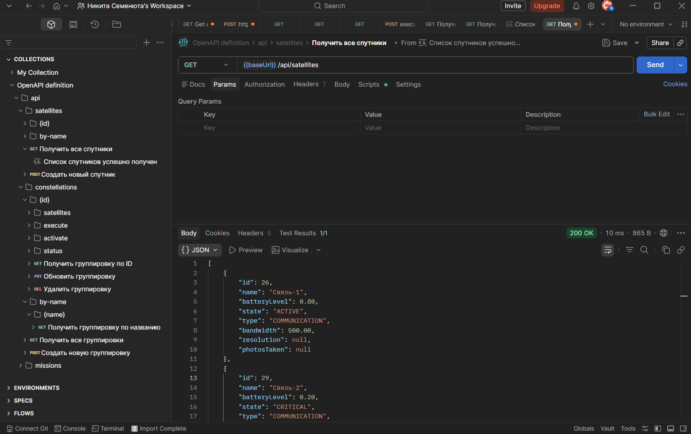
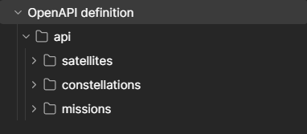
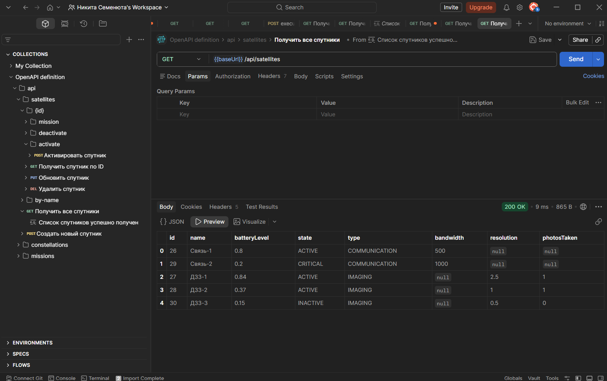
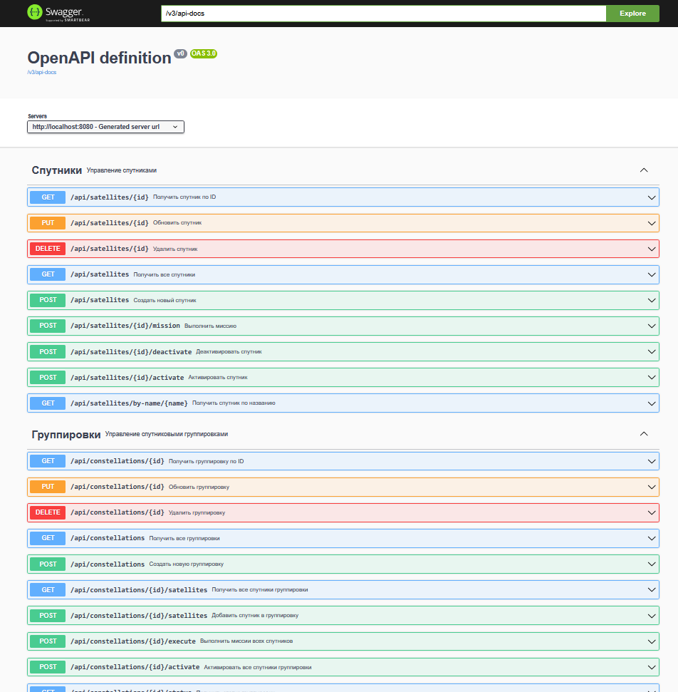

# Формирование запросов

Запросы сформированы на основе спецификации http://localhost:8080/v3/api-docs

На ее основе создано 3 группы 

Пример для получения всех спутников 

[Postman файл](docs/OpenAPI%20definition.postman_collection.json)

Аналогично организован swagger интерфейс

